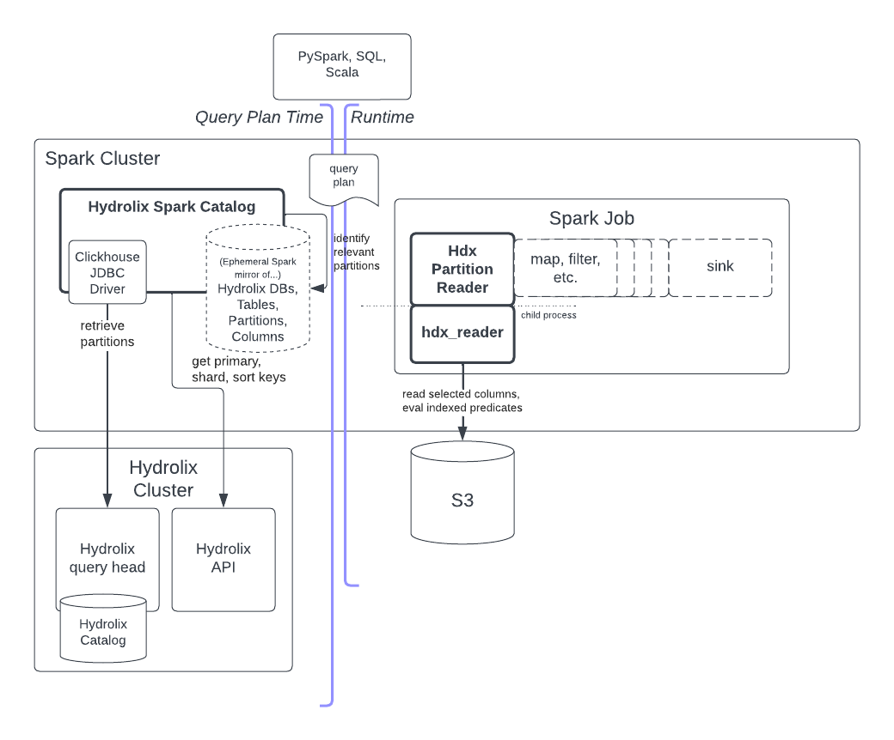

# Hydrolix Spark Connector

## Overview

This is a Spark TableCatalog/"DataSourceV2" implementation that lets customers write Spark 3.3.x and 3.4.x jobs that 
directly query data stored in [Hydrolix](https://hydrolix.io/) tables, without any ETL process.

The mainline Hydrolix query engine only supports the Clickhouse SQL dialect, but this connector can execute queries in 
any of the following:
 * Spark SQL
 * Scala
 * PySpark

In fact, the connector supports queries using an any arbitrary combination of these languages, thanks to Spark's 
unifying DataFrame abstraction.

## Architecture



### Hydrolix Spark Catalog
* Implements the Spark [TableCatalog](https://spark.apache.org/docs/3.3.2/api/java/org/apache/spark/sql/connector/catalog/TableCatalog.html) 
  interface
* Makes requests to the Hydrolix query head (via JDBC) and API (via REST client) to collect 
  metadata about the databases, tables and columns that are accessible to the authenticated user.
* Provides implementations of the Spark types necessary to run queries, including: 

  | Spark Type                                                                                                                             | Connector Implementation                                                                                         | 
  |----------------------------------------------------------------------------------------------------------------------------------------|------------------------------------------------------------------------------------------------------------------|
  | [Table](https://spark.apache.org/docs/3.3.2/api/java/org/apache/spark/sql/connector/catalog/Table.html)                                | [HdxTable](./connector/src/main/scala/io/hydrolix/spark/connector/HdxTable.scala)                                |
  | [ScanBuilder](https://spark.apache.org/docs/3.3.2/api/java/org/apache/spark/sql/connector/read/ScanBuilder.html)                       | [HdxScanBuilder](./connector/src/main/scala/io/hydrolix/spark/connector/HdxScanBuilder.scala)                    |
  | [Scan](https://spark.apache.org/docs/3.3.2/api/java/org/apache/spark/sql/connector/read/Scan.html)                                     | [HdxScan](./connector/src/main/scala/io/hydrolix/spark/connector/HdxScan.scala)                                  | 
  | [Batch](https://spark.apache.org/docs/3.3.2/api/java/org/apache/spark/sql/connector/read/Batch.html)                                   | [HdxBatch](./connector/src/main/scala/io/hydrolix/spark/connector/HdxBatch.scala)                                | 
  | [PartitionReaderFactory](https://spark.apache.org/docs/3.3.2/api/java/org/apache/spark/sql/connector/read/PartitionReaderFactory.html) | [HdxPartitionReaderFactory](./connector/src/main/scala/io/hydrolix/spark/connector/HdxPartitionReader.scala#L23) |
  | [InputPartition](https://spark.apache.org/docs/3.3.2/api/java/org/apache/spark/sql/connector/read/InputPartition.html)                 | [HdxInputPartition](./connector/src/main/scala/io/hydrolix/spark/connector/HdxScanPartition.scala)               |
  | [PartitionReader](https://spark.apache.org/docs/3.3.2/api/java/org/apache/spark/sql/connector/read/PartitionReader.html)               | [HdxInputPartition](./connector/src/main/scala/io/hydrolix/spark/connector/HdxPartitionReader.scala#L31)         |

### Hydrolix Cluster
A preexisting Hydrolix cluster; must be [version 3.40.5](https://docs.hydrolix.io/changelog/9-may-2023-v3404) or later.
The connector must be able to access the Hydrolix API (typically on port 443) and the Clickhouse Native protocol 
(typically on port 9440).

#### Query Head
The connector talks to the Hydrolix query head at query planning time using the Clickhouse JDBC driver to retrieve 
partition metadata. The connector does not use the query head for query execution. 

#### API
The connector talks to the Hydrolix API at query planning time using a REST client to retrieve database, table and 
column metadata. The connector does not use the API for query execution.

## Feature Set
### Query Optimizations
The connector supports the following query optimizations, in addition to the logical optimizations Spark already applies 
(e.g. removing tautologies, simplifying Boolean expressions)

#### Partition Pruning
When the query has suitable predicates based on the timestamp and/or shard key, we can use them to eliminate partitions 
from consideration based on each partition’s min/max timestamps and shard key. In some cases this can be extremely effective, especially in high-selectivity queries (e.g. timestamp in a narrow range).

#### Predicate Pushdown
Suitable predicates that do simple comparisons between indexed fields and literals are evaluated by the low-level 
`turbine_cmd hdx_reader` using Hydrolix indexes. Note that `hdx_reader` only applies block-level filters, so these
predicates still need to be evaluated by Spark after scanning. Also note that due to a (hopefully) temporary 
implementation restriction, only predicates on string-typed columns can be pushed down for block filtering; any other 
predicates need to be evaluated by Spark post-scanning.

#### Column Pruning
When queries only reference a subset of columns (e.g. `a`, `b` and `c` in `SELECT a, b WHERE c='foo'`), we only read the 
columns that are referenced.

#### Aggregate Pushdown
For queries that _only_ contain the following aggregates, no other selected expressions, and no `GROUP BY` or `WHERE` 
clauses, we exclusively use partition metadata to answer such queries very quickly.
* `COUNT(*)`
* `MIN(<primary key field>)`
* `MAX(<primary key field>)`

### Unsupported Features
#### Writing Data
The Hydrolix Spark Connector is currently read-only; any attempt to execute DDL or DML queries (or their Python/Scala 
equivalents) will result in an error.

## System Requirements

### Operating System
Currently, the connector only runs on recent AMD64/x86_64 Linux distros. Ubuntu 22.x and Fedora 38 work fine; 
Ubuntu 20.x definitely doesn't work; other distros MIGHT work. It DOES NOT work on macOS, because it uses a 
native binary built from the C++ source tree, which can only target Linux at this time.

### Spark
You’ll need to download a copy of Apache Spark 3.3.2 or 3.4.0, compiled for Scala 2.12. You can untar it to wherever you 
like and use it as-is, no configuration files need to be updated.

### Connector Jar
You’ll need the connector jar, which can be resolved using the usual Maven machinery at the following coordinates:

TODO

Otherwise, if you’re building locally, it will show up at [./connector/target/scala-2.12/connector-assembly-1.0.0-SNAPSHOT.jar](./connector/target/scala-2.12/connector-assembly-1.0.0-SNAPSHOT.jar). 

## Running

To run it, have a look at the [GCS](./connector/spark-2.12-gcs.sh) or [AWS](./connector/spark-2.12-aws.sh) scripts 
in the source tree, which will give you an indication of what parameters you need to launch Spark with the connector. 

The parameters are explained in this table. Note that the configuration parameters can always be set from `spark-shell` 
or a notebook using `spark.conf.set(<name>, <value>)`, they don't need to be provided on startup.

| Option Name                             | Option Value                                | Description                                                                                                      |
|-----------------------------------------|---------------------------------------------|------------------------------------------------------------------------------------------------------------------|
| spark.sql.catalog.hydrolix              | io.hydrolix.spark.connector.HdxTableCatalog | The fully qualified name of the class to instantiate when you ask for the `hydrolix` catalog.                    |
| spark.sql.catalog.hydrolix.org_id       | <hydrolix organization UUID>                | The organization ID you want to authenticate to (see https://docs.hydrolix.io/reference/summary-of-organization) |
| spark.sql.catalog.hydrolix.jdbc_url     | jdbc:clickhouse://<host>:<port>/?ssl=true   | JDBC URL of the Hydrolix query head                                                                              |
| spark.sql.catalog.hydrolix.username     | <hdx user name>                             | Username to login to the Hydrolix cluster                                                                        |
| spark.sql.catalog.hydrolix.password     | <hdx password>                              | Password to login to the Hydrolix cluster                                                                        |
| spark.sql.catalog.hydrolix.api_url      | https://<hdx-cluster-host>/config/v1/       | URL of the Hydrolix config API, usually must end with `/config/v1/` including trailing slash                     |
| spark.sql.catalog.hydrolix.cloud_cred_1 | <base64 or AWS access key ID>               | First cloud credential. Either a base64(GZIP(GCP service account key file)), or an AWS access key ID.            |
| spark.sql.catalog.hydrolix.cloud_cred_2 | <AWS secret>                                | Second cloud credential. Not used for GCP; the AWS secret key for AWS.                                           |

## Building

1. Install [SBT](https://scala-sbt.org/) however you prefer. Your Linux distro might have it packaged already.
2. ```
   git clone git@gitlab.com:hydrolix/interop-spark.git && cd interop-spark
   ```
3. Run `sbt assembly` to compile and build the connector jar file.
4. If the build succeeds, the jar can be found at [./connector/target/scala-2.12/connector-assembly-1.0.0-SNAPSHOT.jar](./connector/target/scala-2.12/connector-assembly-1.0.0-SNAPSHOT.jar).

## Roadmap

### Dictionary Tables
Map [Hydrolix dictionaries](https://docs.hydrolix.io/docs/dictionaries-user-defined-functions) to Spark tables so they 
can be queried more naturally using `JOIN`s

### Performance
#### ColumnarBatch
Spark’s PartitionReaderFactory interface supports both row-oriented and columnar operating modes. The Hydrolix Spark 
connector currently uses the row-oriented mode, but we should be able to achieve higher query performance by switching 
to the columnar mode, which unlocks some vectorization opportunities.

#### Additional Aggregate Pushdown
We already run queries that only contain `COUNT(*)`, `MIN(timestamp)` and/or `MAX(timestamp)` with no `GROUP BY` or 
`WHERE` purely from the catalog, with no partition scanning at all. We could add aggregate pushdown for queries with 
some narrowly specified types of `GROUP BY` or `WHERE` clauses as well.

### Integrations

#### Secret Management Integration
Currently, the Hydrolix Spark connector needs to be directly supplied with credentials to access Hydrolix clusters and 
cloud storage. We should add integrations to retrieve credentials from various secret stores, e.g.:
* Kubernetes Secrets
* AWS Secrets Manager
* GCP Secret Manager

## Changelog

### 1.0.0
Initial 