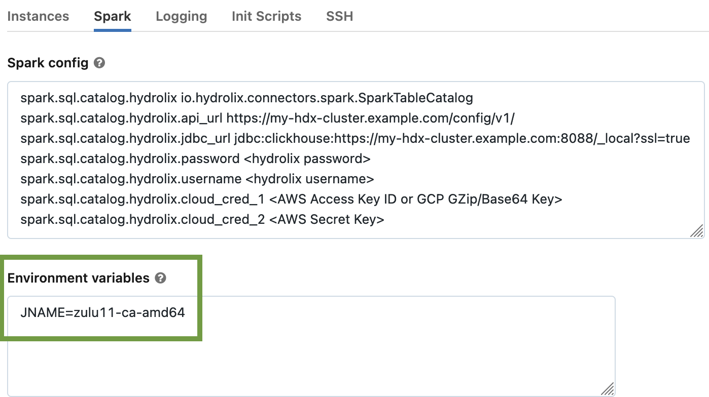
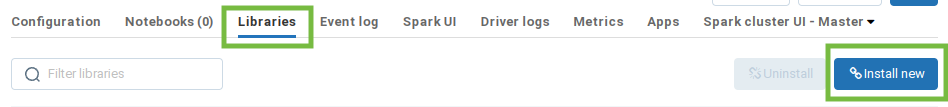
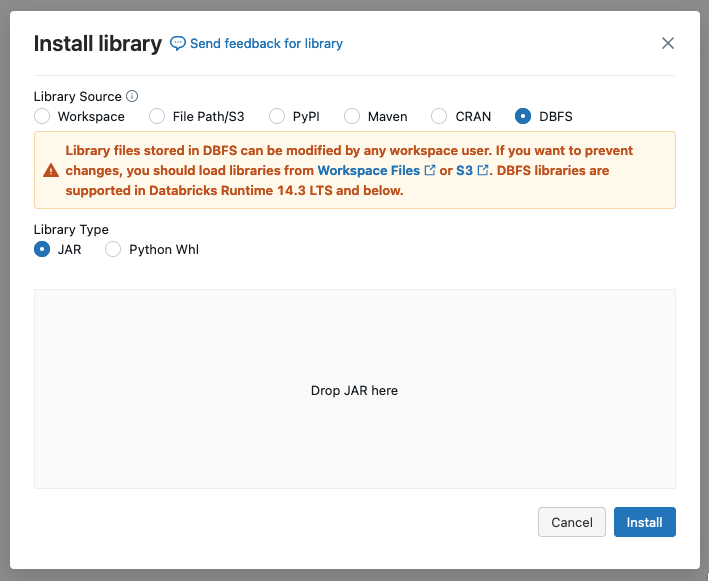

# Hydrolix Spark Connector

## Overview

This is a Spark [TableCatalog](https://spark.apache.org/docs/3.3.2/api/java/org/apache/spark/sql/connector/catalog/TableCatalog.html)/"DataSourceV2" 
implementation that lets customers write Spark 3.3.x and 3.4.x jobs that directly query data stored in 
[Hydrolix](https://hydrolix.io/) tables, without any ETL process.

The mainline Hydrolix query engine supports the [Clickhouse SQL dialect](https://clickhouse.com/docs/en/sql-reference), 
but this connector can execute queries in any of the following:
 * Spark SQL
 * Scala
 * PySpark

In fact, the connector supports queries using an any arbitrary combination of these languages, thanks to Spark's 
unifying DataFrame abstraction.

## Architecture


### Hydrolix Spark Catalog
* Implements the Spark [TableCatalog](https://spark.apache.org/docs/3.3.2/api/java/org/apache/spark/sql/connector/catalog/TableCatalog.html) 
  interface
* Makes requests to the Hydrolix query head (via JDBC) and API (via REST client) to collect metadata about the 
  databases, tables, partitions and columns that are accessible to the authenticated user.
* Provides implementations of the Spark types necessary to run queries, including: 

  | Spark Type                                                                                                                             | Connector Implementation                                                                                                             | 
  |----------------------------------------------------------------------------------------------------------------------------------------|--------------------------------------------------------------------------------------------------------------------------------------|
  | [Table](https://spark.apache.org/docs/3.3.2/api/java/org/apache/spark/sql/connector/catalog/Table.html)                                | [SparkTable](./src/main/scala/io/hydrolix/connectors/spark/SparkTable.scala)                                                         |
  | [ScanBuilder](https://spark.apache.org/docs/3.3.2/api/java/org/apache/spark/sql/connector/read/ScanBuilder.html)                       | [SparkScanBuilder](./src/main/scala/io/hydrolix/connectors/spark/SparkScanBuilder.scala)                                             |
  | [Scan](https://spark.apache.org/docs/3.3.2/api/java/org/apache/spark/sql/connector/read/Scan.html)                                     | [SparkScan](./src/main/scala/io/hydrolix/connectors/spark/SparkScan.scala)                                                           | 
  | [Batch](https://spark.apache.org/docs/3.3.2/api/java/org/apache/spark/sql/connector/read/Batch.html)                                   | [SparkBatch](./src/main/scala/io/hydrolix/connectors/spark/SparkBatch.scala)                                                         | 
  | [PartitionReaderFactory](https://spark.apache.org/docs/3.3.2/api/java/org/apache/spark/sql/connector/read/PartitionReaderFactory.html) | [SparkRowPartitionReaderFactory](./src/main/scala/io/hydrolix/connectors/spark/partitionreader/SparkRowPartitionReader.scala#L30-42) |
  | [InputPartition](https://spark.apache.org/docs/3.3.2/api/java/org/apache/spark/sql/connector/read/InputPartition.html)                 | [SparkScanPartition](./src/main/scala/io/hydrolix/connectors/spark/SparkScanPartition.scala)                                         |
  | [PartitionReader](https://spark.apache.org/docs/3.3.2/api/java/org/apache/spark/sql/connector/read/PartitionReader.html)               | [HdxPartitionReader](./src/main/scala/io/hydrolix/connectors/spark/partitionreader/SparkRowPartitionReader.scala#L44-61)             |

### hdx_reader
An operating mode of the `turbine_cmd` binary, launched by `HdxPartitionReader` as a child process to read Hydrolix 
partitions. Packaged in the JAR, [not open source](#proprietary)!

### Hydrolix Cluster
A preexisting Hydrolix cluster; must be [version 3.40.5](https://docs.hydrolix.io/changelog/9-may-2023-v3404) or later.
The connector must be able to access the Hydrolix API (typically on port 443) and the Clickhouse Native protocol 
(typically on port 9440).

#### API
The connector talks to the Hydrolix API at query planning time using a REST client to authenticate, and to retrieve 
database, table and column metadata. The connector does not use the API for query execution.

#### Query Head
The connector talks to the Hydrolix query head at query planning time using the Clickhouse JDBC driver to retrieve 
partition and column index metadata. The connector does not use the query head for query execution. 

## Feature Set
### Query Optimizations
The connector supports the following query optimizations, in addition to the logical optimizations Spark already applies 
(e.g. removing tautologies, simplifying Boolean expressions)

#### Partition Pruning
When the query has suitable predicates based on the timestamp and/or shard key, we can use them to eliminate partitions 
from consideration based on each partition’s min/max timestamps and shard key. In some cases this can be extremely 
effective, especially in high-selectivity queries (e.g. timestamp in a narrow range).

#### Predicate Pushdown
Suitable predicates that do simple comparisons between indexed fields and literals are evaluated by the low-level 
`turbine_cmd hdx_reader` using Hydrolix indexes. Note that `hdx_reader` only applies block-level filters, so these
predicates still need to be evaluated by Spark after scanning. Also note that due to a (hopefully) temporary 
implementation restriction, only predicates on string-typed columns can be pushed down for block filtering; any other 
predicates need to be evaluated by Spark post-scanning.

#### Column Pruning
When queries only reference a subset of columns (e.g. `a`, `b` and `c` in `SELECT a, b WHERE c='foo'`), we only read the 
columns that are referenced.

#### Aggregate Pushdown
For queries that _only_ contain the following aggregates, no other selected expressions, and no `GROUP BY` or `WHERE` 
clauses, we exclusively use partition metadata to answer such queries very quickly.
* `COUNT(*)`
* `MIN(<primary key field>)`
* `MAX(<primary key field>)`

### Unsupported Features
#### Writing Data
The Hydrolix Spark Connector is currently read-only; any attempt to execute DDL or DML queries (or their Python/Scala 
equivalents) will result in an error.

#### Dictionary Tables
(see [roadmap](#dictionary-tables-1) item)

## Licenses

### Apache 2.0
The following are released under the [Apache 2.0 license](./licenses/Apache_License_2.0.txt):
* All files in [src/main/scala](./src/main/scala)
* All files in [src/test/scala](./src/test/scala)
* All files in [scripts](./scripts)
* All files in [doc](./doc)
* [build.sbt](./build.sbt)
* [project/plugins.sbt](./project/plugins.sbt)
* [project/build.properties](./project/build.properties)

### Proprietary
* This connector depends on the [connectors-core](https://github.com/hydrolix/connectors-core) library, which contains 
  some proprietary components

### Other
Dependencies are used under a variety of open source licenses; see [NOTICE.md](./NOTICE.md)

## System Requirements

### JVM
The Hydrolix Spark Connector requires a minimum Java version of 11; later versions might work. Java 8 definitely 
doesn't.

### Scala
The connector is built exclusively for Scala 2.12 at the moment. You don't need to install Scala yourself, the build 
system will take care of it.

### Operating System
Currently, the connector only runs on recent AMD64/x86_64 Linux distros. Ubuntu 22.x and Fedora 38 work fine; 
Ubuntu 20.x definitely doesn't work; other distros MIGHT work. It DOES NOT work on macOS, because it uses a 
native binary built from the C++ source tree, which can only target Linux at this time.

You can *build* the connector on macOS, it just won't run. Sorry.

### Spark (for local deployments)
You’ll need to download a copy of Apache Spark 3.3.2 or 3.4.0, compiled for Scala 2.12. You can untar it to wherever you 
like and use it as-is, no configuration files need to be updated.

### Connector Jar
You’ll need the connector jar, which can be resolved using the usual Maven machinery at the following coordinates:

#### SBT
```
  libraryDependencies += "io.hydrolix" %% "hydrolix-spark-connector" % "1.6.0-SNAPSHOT"
```
(note that we only build for Scala 2.12 at the moment)
#### Gradle (Kotlin)
```
  implementation("io.hydrolix:hydrolix-spark-connector_2.12:1.6.0-SNAPSHOT")
```
#### Gradle (Groovy)
```
  implementation 'io.hydrolix:hydrolix-spark-connector_2.12:1.6.0-SNAPSHOT'
```
#### Maven
```
  <dependency>
    <groupId>io.hydrolix</groupId>
    <artifactId>hydrolix-spark-connector_2.12</artifactId>
    <version>1.6.0-SNAPSHOT</version>
  </dependency>
```

Otherwise, if you’re building locally, it will show up at [./target/scala-2.12/hydrolix-spark-connector-assembly_2.12-1.6.0-SNAPSHOT.jar](./target/scala-2.12/hydrolix-spark-connector-assembly_2.12-1.6.0-SNAPSHOT.jar). 

## Building

1. Install [SBT](https://scala-sbt.org/) however you prefer. Your Linux distro might have it packaged already.
2. ```
   git clone git@github.com:hydrolix/spark-connector.git hydrolix-spark-connector && cd hydrolix-spark-connector
   ```
3. Run `sbt  -J-Xmx4G assembly` to compile and build the connector jar file.
4. If the build succeeds, it will produce a file named similarly to  `hydrolix-spark-connector-assembly_2.12-1.6.0-SNAPSHOT.jar` in the `target/scala` directory. This file is later specified as one of the inputs when starting the Spark shell.

## Running

### Local Deployment
For local testing, look at the [GCS](scripts/spark-2.12-gcs.sh) or [AWS](scripts/spark-2.12-aws.sh) scripts for inspiration.

<!-- ### Deploying on Databricks
1. Databricks Runtime 13 or higher is required
2. Upload the [connector jar](./target/scala-2.12/hydrolix-spark-connector-assembly_2.12-1.6.0-SNAPSHOT.jar) in the Libraries 
   tab, or use its [Maven coordinates](#connector-jar). 
3. Select JDK11 by [setting an environment variable](https://docs.databricks.com/release-notes/runtime/10.0.html#cluster-support-for-jdk-11-public-preview) 
   in `Advanced Options > Spark > Environment Variables`
4. Set `Policy` to `Unrestricted`
5. Set `Access mode` to `No isolation shared`
6. (Optional) apply configuration settings as space-separated name-value pairs in 
   `Advanced Options > Spark > Spark config`, e.g. for AWS:
   ```
   spark.sql.catalog.hydrolix io.hydrolix.connectors.spark.SparkTableCatalog
   spark.sql.catalog.hydrolix.api_url https://my-hdx-cluster.example.com/config/v1/
   spark.sql.catalog.hydrolix.jdbc_url jdbc:clickhouse://my-hdx-cluster.example.com:8088?ssl=true
   spark.sql.catalog.hydrolix.username <hydrolix username>
   spark.sql.catalog.hydrolix.password <hydrolix password>
   spark.sql.catalog.hydrolix.cloud_cred_1 <access key ID>
   spark.sql.catalog.hydrolix.cloud_cred_2 <secret key>
   ```
   **Note:** these settings can also be applied in a notebook or from spark-shell, using 
   `spark.conf.set(<key>, <value>)`, which also allows credentials to be loaded from the Databricks secrets API; see
   [Note: Credentials](#note-credentials)  -->
<!-- 
### Deploying on AWS Elastic MapReduce (EMR)
1. AWS EMR 6.10.0 or later is required
2. Configure JDK 11, as in [this StackOverflow answer](https://stackoverflow.com/a/72054500)
3. TODO! -->

## Prepare the Hydrolix Spark Connector Parameters

The Hydrolix Spark Connector requires the following configuration parameters. These parameters can be specified in the Databricks UI when creating a cluster. The ‘...’ prefix in these option names should be replaced with `spark.sql.catalog.hydrolix`.

| **Option name** | **Value**                                               | **Description**                                                                                                                                                                                      |
| --------------- | ------------------------------------------------------- | ---------------------------------------------------------------------------------------------------------------------------------------------------------------------------------------------------- |
| ...             | io.hydrolix.connectors.spark.SparkTableCatalog          | Fully-qualified name of the Scala class to instantiate when the hydrolix catalog is selected                                                                                                         |
| ...api_url      | https\://\<hdx-cluster\>/config/v1/                     | API URL of your Hydrolix cluster, ends with "/config/v1/" including the trailing slash                                                                                                               |
| ...jdbc_url     | jdbc:clickhouse://\<hdx-cluster\>:8088/\_local?ssl=true | JDBC URL of your Hydrolix cluster                                                                                                                                                                    |
| ...username     | \<user name\>                                           | Hydrolix cluster username                                                                                                                                                                            |
| ...password     | \<password\>                                            | Hydrolix cluster password                                                                                                                                                                            |
| ...cloud_cred_1 | \<Google base64 key or AWS access key ID\>              | First cloud credential. For AWS, this is an AWS access key ID. For Google Cloud, this is the contents of the Google Cloud service account key file, compressed with gzip and then encoded as base64. |
| ...cloud_cred_2 | \<AWS secret\>                                          | This is only needed for AWS, not Google Cloud.                                                       |

### Configure the Spark Cluster

Create a Spark cluster in your Databricks workspace with the following configuration:

- **Policy:** Unrestricted
- **Access Mode:** No Isolation Shared
- **Databricks Runtime Version:** Version 13 or later

The next image shows how the configuration should look. The image may be slightly different as Databricks makes changes to their UI.


Set additional configuration parameters. In the **Advanced Options** section, open the Spark tab as shown in the following image.  


Set the following Spark configuration [parameters](https://hydrolix.io/spark-connector-with-databricks/#Configuring_the_Hydrolix_Spark_Connector):

- `spark.sql.catalog.hydrolix`
- `spark.sql.catalog.hydrolix.api_url`
- `spark.sql.catalog.hydrolix.jdbc_url`
- `spark.sql.catalog.hydrolix.username `
- `spark.sql.catalog.hydrolix.password `
- `spark.sql.catalog.hydrolix.cloud_cred_1 `
- `spark.sql.catalog.hydrolix.cloud_cred_2` (only for AWS)

Set the Hydrolix Spark Connector’s [configuration parameters](https://github.com/hydrolix/spark-connector#configuration-parameter-details) in the **Advanced Options** section as name-value pairs delimited by whitespace, or configure them in a notebook using `spark.conf.set(<key>, <value>)`, allowing you to use Databricks Secrets.

### Credentials With Google Cloud Platform

If you’re using Google Cloud with Databricks, set the `hydrolix.cloud_cred_1` parameter to the base64-encoded gzipped key value. If you don't have this key, create one and download it from the Google Cloud Console, navigating to `IAM & Admin->Service Accounts`, clicking on your service account, then clicking on the `Keys` tab. 

Store this file somewhere secure, then create the gzip'ed and base64-encoded version. For example, with a keyfile called <keyfilename>.json, use this command on a Linux or OS X machine: 

```shell
cat <keyfilename>.json | gzip | base64
```

Next, include the entire resulting string as one line in the `spark.sql.catalog.hydrolix.cloud_cred_1` parameter:

```
spark.sql.catalog.hydrolix.cloud_cred_1 <gcpKeyBase64>
```

You do not need to specify `spark.sql.catalog.hydrolix.cloud_cred_2` with Google Cloud Storage.

### Credentials With AWS

When using Databricks in AWS, set your cloud credentials to the following:

```
spark.sql.catalog.hydrolix.cloud_cred_1 <AWS_ACCESS_KEY_ID>
spark.sql.catalog.hydrolix.cloud_cred_2 <AWS_SECRET_KEY>
```

### Set the JNAME Environment Variable

Enable the use of JDK11 by setting the JNAME environment variable to `zulu11-ca-amd64`, as shown in the following image.



Click the "Create Compute" button to save your work.

## Upload and Install the Hydrolix Spark Connector</span>

In the **Libraries** tab for the Spark cluster, select **Install new** as shown in the next image.



Make sure the **DBFS** and **JAR** options are selected as shown in the following image.



In your local file manager, navigate to the `target/scala-2.12` subfolder of the `hydrolix-spark-connector` source tree, and move `hydrolix-spark-connector-assembly-1.1.1-SNAPSHOT.jar` (or similarly-named JAR file) into the **Drop JAR here** window that’s shown in the previous image. 

Don’t select anything while it’s uploading or you’ll have to upload the file again. After the upload is finished, you’ll see a green checkmark next to the file as shown in the next image.


Once the upload is finished, select **Install** and wait a few minutes while the cluster restarts. You can now start analyzing your Hydrolix data in Spark!

## Use the Hydrolix Spark Connector With a Spark Notebook

After you have configured your cluster, you can use the Hydrolix Spark Connector in a Spark notebook.

To begin using the connector with a Spark notebook, you’ll use one of the two commands depending on your use case:

- **SQL fragment:** `%sql`.
- **Python or Scala fragment:** `sql("use hydrolix")`.

Then use your Spark notebook to make a SQL query or use the Dataframe API:

```sql
%sql
SELECT
user_agent,
count(*) AS count
FROM hydrolix.hydrolix_project.hydrolix_table
WHERE
my_timestamp_column BETWEEN '2023-05-10T00:00:00.000Z' AND '2023-05-10T00:00:01.000Z'
GROUP BY
user_agent
ORDER BY
count DESC
```
```python
from pyspark.sql.functions import col, desc, count

my_table = table("hydrolix_project.hydrolix_table")
ts = col("my_timestamp_column")

sample_df = my_table.filter(ts.between('2023-05-10T00:00:00.000Z', '2023-05-10T00:00:01.000Z')) \
    .groupBy(my_table.user_agent) \
    .agg(count("*").alias("count")) \
    .orderBy(desc("count")) \
    .cache()
```

#### Note: Credentials
If you don't want to put your credentials in your Databricks configuration, you can set all configuration options at runtime instead. All of the above configuration options can be set at runtime, so there's no need to hardcode credentials in cluster/job 
launch scripts. For example, in Python, when running the connector in a Databricks workspace, you can retrieve and set credentials from the 
Databricks secret manager like so:

```
spark.conf.set("spark.sql.catalog.hydrolix.password", dbutils.secrets.get("my-scope", "hdx-password"))
spark.conf.set("spark.sql.catalog.hydrolix.cloud_cred_1", dbutils.secrets.get("my-scope", "aws_access_key_id"))
spark.conf.set("spark.sql.catalog.hydrolix.cloud_cred_2", dbutils.secrets.get("my-scope", "aws_secret_access_key"))
...
sql("use hydrolix")
```

### Querying

```
%sql

use hydrolix

select count(*), min(timestamp), max(timestamp) from hydro.logs
```

```
%scala

sql("use hydrolix")

val logs = spark.sqlContext.table("hydro.logs")

val recent = logs.filter(col("timestamp") > "2023-06-01T00:00:00.000Z"))

recent.count()
```
## Troubleshooting

### Timeout errors

- If you see timeout errors from the Hydrolix database when you are making queries, make sure you have the IP address of your Spark cluster listed in your hydrolixcluster.yaml `ip_allowlist`.
- If you see "access denied' errors from the Hydrolix database when you are making queries, ensure the username and password are correct, and make sure that user has query permissions.

## Roadmap

### Dictionary Tables
Map [Hydrolix dictionaries](https://docs.hydrolix.io/docs/dictionaries-user-defined-functions) to Spark tables, so they 
can be queried more naturally using `JOIN`s

### Performance

#### Additional Aggregate Pushdown
We already run queries that only contain `COUNT(*)`, `MIN(timestamp)` and/or `MAX(timestamp)` with no `GROUP BY` or 
`WHERE` purely from the catalog, with no partition scanning at all. We could add aggregate pushdown for queries with 
some narrowly specified types of `GROUP BY` or `WHERE` clauses as well.

### Integrations

#### Secret Management Integration
Currently, the Hydrolix Spark connector needs to be directly supplied with credentials to access Hydrolix clusters and 
cloud storage. We should add integrations to retrieve credentials from various secret stores, e.g.:
* Kubernetes Secrets
* AWS Secrets Manager
* GCP Secret Manager

## Changelog

### 1.6.0
* Cope with connectors-core 1.5.0 changes

### 1.5.0
Rebased on [connectors-core](https://github.com/hydrolix/connectors-core), with a few performance improvements:
* Catalog queries now include min/max time bounds where applicable
* For simple query schemas (where there are no nested maps), we now use [ColumnarBatch](https://spark.apache.org/docs/latest/api/java/org/apache/spark/sql/vectorized/ColumnarBatch.html)
  to return data from the PartitionReader, which should unlock vectorization opportunities.

### 1.0.0
Initial public release!
